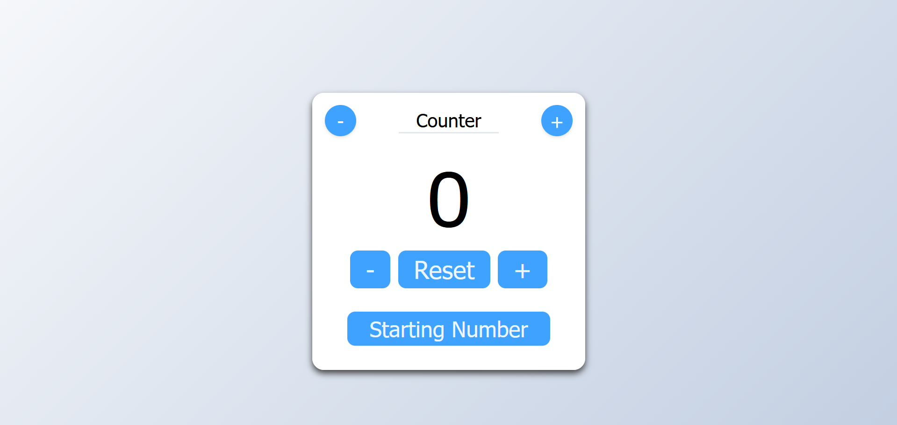
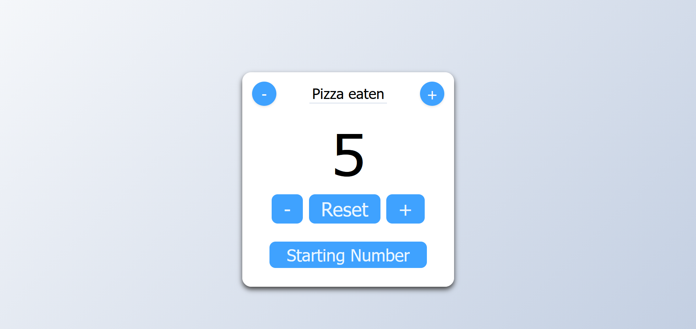
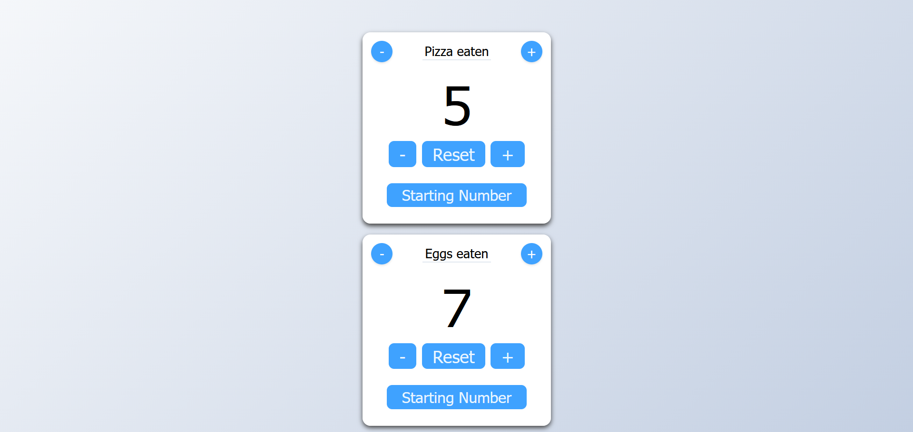

# counter-app

## Simple counter program made using HTML-CSS-JS

This project showcase a simple counter program to be a part of my personal learning experience through frontend developement, this project contains the following functionalities:

1. Mutiple instace capability.
2. Naming individual counter.
3. Starting number count.

## How it works
- Creates components using DOM manipulation
- Assign each counter instances an event listeners and state logic
- Ensure there is atleast one counter active

## Screenshots
### Default Interface

### Example Interface

### Multi-Counter Instace

## How to run
1. Download the project
2. Open index.html
